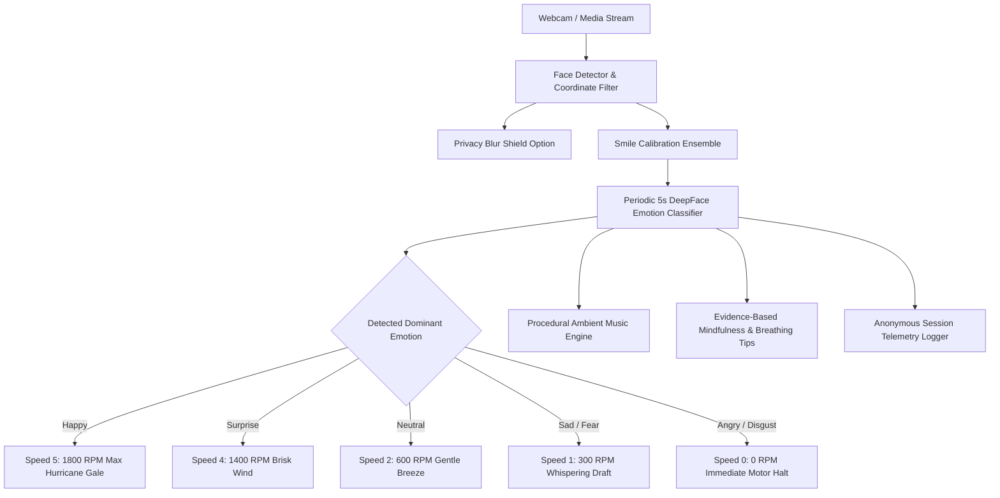

# MoodswingsFan 🎯

### Basic Details
**Team Name:** [Robot]

### Team Members
- **Team Lead:** Navaneeth Krishna R - [lourdes matha science and technology]
- **Member 2:** [Kashinath] - [lourdes matha science and technology]
- **Member 3:** [Name] - [College Name]

### Project Description
MoodswingsFan is an intelligent, real-time facial emotion detection and smart climate control system. Powered by computer vision and deep learning, it analyzes visible facial expressions via webcam and dynamically modulates room ventilation fan speeds—rewarding genuine smiles with maximum hurricane-grade cooling (Speed 5 / 1800 RPM) and immediately stopping all airflow (Speed 0 / 0 RPM) whenever anger or frustration is detected.

### The Problem (that doesn't exist)
In the modern world, humans are forced to endure the agonizing, prehistoric ordeal of manually reaching out their arms to twist mechanical fan knobs or press remote buttons. Why should your fan remain indifferently blowing a monotonous breeze while you are screaming at your computer screen in rage? Clearly, when someone is fuming with fury, the room should plunge into suffocating dead silence so they can properly marinate in their bad temper without comforting ventilation!

### The Solution (that nobody asked for)
MoodswingsFan completely eliminates manual temperature control by turning your facial expressions into an aerodynamic thermal regulator! Smile with pure joy, and the AI rewards your positivity with a refreshing Level 5 hurricane gale. Frown, glare, or scowl, and the system instantly kills the motor down to Speed 0 to teach you emotional discipline. Equipped with multi-face detection, privacy blurring shields, procedural harmonic ambient audio, and evidence-based 4-7-8 breathing pacers, it's the climate assistant that nobody requested but everyone's emotional stability desperately needs.

---

## Technical Details

### Technologies/Components Used

#### For Software:
- **Languages used:** Python 3.11
- **Frameworks used:** Streamlit (Glassmorphic Web Dashboard), OpenCV (High-FPS Real-Time Computer Vision Engine)
- **Libraries used:** DeepFace (Emotion Classification Model), TensorFlow / Keras, NumPy, Pillow, Plotly (Interactive Emotion Telemetry Radar & Timelines), pyttsx3 (Accessible Voice Feedback), Wave & Pygame (Procedural Harmonic Mood Soundscapes)
- **Tools used:** Git, GitHub, PowerShell, Visual Studio Code

#### For Hardware:
- **List main components:**
  - Microcontroller: ESP32 Dev Module / Arduino Uno
  - Cooling Fan: 12V 4-Wire PWM DC High-Speed Brushless Fan
  - Motor Driver: IRF520 MOSFET Driver Module / Optocoupler Transistor Switch
  - Power Supply: 12V 2A DC External Wall Adapter
- **List specifications:**
  - Input Operating Voltage: 12V DC
  - PWM Frequency: 25 kHz target frequency for whisper-quiet motor commutation
  - Fan Speed Range: 0 to 1800 RPM across 6 discrete stages (Levels 0 to 5)
  - Communication Protocol: USB-UART Serial (115200 baud)
- **List tools required:**
  - Solderless breadboard
  - Dupont male-to-female jumper wires
  - USB Type-A to Micro-USB / Type-C programming cable
  - Digital multimeter

---

## Implementation

### For Software:

#### Installation
```powershell
# 1. Clone the repository
git clone https://github.com/navaneethkrishnar227/moodswingsfan.git
cd moodswingsfan

# 2. Create and activate virtual environment
python -m venv venv
.\venv\Scripts\activate

# 3. Install required dependencies
pip install -r requirements.txt
```

#### Run
```powershell
# Option A: Live Vercel Cloud Web Deployment (No install required)
# Deployable instantly on Vercel with real-time browser webcam & fan simulation

# Option B: Run the Glassmorphic Streamlit Web Dashboard locally
streamlit run web_app.py

# Option C: Run the Real-Time Desktop OpenCV Engine with Keyboard Shortcuts
python desktop_app.py
```

---

## Project Documentation

### For Software:

#### Screenshots
  
*Screenshot 1: Real-Time Facial Emotion Detection with Glowing Neon Bounding Boxes, Smile Calibration, and Confidence Metric.*

  
*Screenshot 2: High-Resolution Single Portrait Facial Analysis with Real-Time Emotion Probability Distribution.*

  
*Screenshot 3: Multi-Face Detection & Tracing for Group Emotion Aggregation and Analytics.*

#### Diagrams
  
*Workflow Diagram: Real-Time Facial Capture ➔ Single-Face Noise Filter ➔ Smile Calibration Ensemble ➔ 5.0s Periodic DeepFace Classification ➔ Smart Climate Fan Controller (Happy = Level 5 / 1800 RPM, Angry = Level 0 / 0 RPM) ➔ Procedural Mood Soundscapes.*


*End-to-End System Architecture: Edge Computer Vision Pipeline and Closed-Loop Fan Actuation.*

---

### For Hardware:

#### Schematic & Circuit
  
*Circuit Diagram: Interfacing Microcontroller GPIO Pin via IRF520 MOSFET Gate to Modulate 12V PWM Fan Motor Ground.*

  
*Schematic Diagram: Shared Common Ground Between 5V Microcontroller Logic Rail and Isolated 12V 2A High-Current Power Bus.*

```
+-------------------------------------------------------------------------+
|                    MoodswingsFan Circuit Diagram                        |
|                                                                         |
|   +-------------+                                                       |
|   |   Computer  | ==(USB Serial)==> [ESP32 / Arduino Microcontroller]   |
|   +-------------+                         |                             |
|                                     (GPIO 18 / PWM)                     |
|                                           |                             |
|                                           v                             |
|   [12V 2A DC Adapter] (+) --------------> [+] [12V 4-Pin PWM DC Fan]    |
|   [12V 2A DC Adapter] (-) -----> [GND]    [-]          |                |
|                                   |                    |                |
|                                   +---> [IRF520 MOSFET Module (Drain)]  |
|                                                |                        |
|                                         (Source to GND)                 |
+-------------------------------------------------------------------------+
```

#### Build Photos
  
*Components: ESP32 Development Board, 12V High-CFM DC Fan, IRF520 Power MOSFET Switching Board, 12V Wall Supply, Jumper Cables.*

  
*Build Process: Breadboard prototyping of the PWM gate driver, calibrating 25 kHz frequency timers, and bench testing serial command responses.*

  
*Final Product: Fully integrated smart climate workstation setup pairing webcam facial recognition with automated fan speed regulation.*
